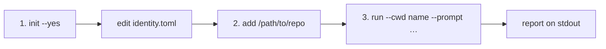

# Quickstart

Install once (`Node 20+`):

```bash
git clone https://github.com/0jrm/runhub.git && cd runhub
npm install && npm run build && npm install -g .
```

Then three steps:



## 1. Init

```bash
runhub init --yes
```

Creates `~/.config/runhub/`, copies `identity.toml` if missing (`chmod 600`). Edit `name` and `email`. Optional: `runhub doctor` (needs `git`; `gh` / agents optional).

## 2. Add a project

```bash
runhub add /home/you/hycom
```

Appends a `projects.toml` table named after the folder. `--cwd hycom` or the absolute path both work.

## 3. Run

```bash
runhub run --cwd hycom --prompt "add a one-line README note about install"
```

Waits and prints `runhub: <runId>` then the report. Exit 0 on pass / changed-untested / no-changes; 1 on fail; 3 still running. `--detach` returns after the id only — then `runhub wait <runId>` or `runhub inspect <runId> -f`.

Stuck? `not in projects.toml` → `runhub add`. Missing identity → `runhub init --identity`. More detail: [CONFIG.md](CONFIG.md).
