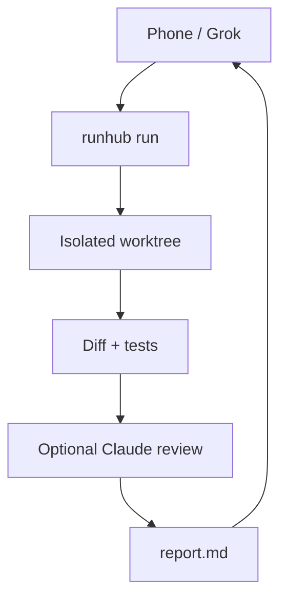

# runhub

You talk to Grok on your phone. Grok runs one command on this laptop. The laptop starts a coding agent in an isolated git worktree, checks the diff, runs tests, optionally asks Claude to review, and leaves a short report.



## Install

Node 20+.

```bash
git clone https://github.com/0jrm/runhub.git
cd runhub
npm install && npm run build && npm install -g .
```

## First run

See [QUICKSTART.md](QUICKSTART.md) — three steps: `init` → `add` → `run`.

```bash
runhub init --yes          # edit ~/.config/runhub/identity.toml
runhub add /path/to/repo
runhub run --cwd <name> --prompt "fix the login bug"
```

`run` waits for the report by default. `--detach` prints `runhub: <runId>` and returns; then `runhub wait <runId>` or `runhub inspect <runId> -f`.

## Everyday

| Command | What it does |
| --- | --- |
| `runhub run --cwd <name> --prompt "…"` | Start a pipeline; wait for the report |
| `runhub run … --detach` | Print id and return; pipeline keeps going |
| `runhub wait <runId>` | Block until the report (default 10m) |
| `runhub status` / `report` / `list` | Snapshot, stored report, recent runs |
| `runhub inspect [runId] [-f]` | Links + log tails (follow until pipeline PID dies) |
| `runhub merge <runId>` | Squash-merge the PR, or merge the branch locally |
| `runhub prune --keep 20` | Drop old local runs |
| `runhub doctor` | Check git / gh / agents |

`--cwd` must be a table name or path from `projects.toml` (else exit 2). Useful flags: `--agent cursor|claude`, `--review claude`, `--model`, `--prompt-file`, `--prompt -`, `--test-cmd`, `--timeout`, `--no-preamble`.

**Outcomes:** `pass` = non-empty diff + tests exited 0. `changed, untested` = files changed but no usable test. `no-changes` = empty diff. `fail` = agent/timeout/test/typecheck/lint failure after a clean base. A `blocked:` line is an irreversible choice — it does not flip pass/fail by itself.

Config, identity, MCP, and logs: [CONFIG.md](CONFIG.md).

## Cursor MCP

```json
{
  "mcpServers": {
    "runhub": {
      "command": "runhub-mcp"
    }
  }
}
```

Tools: `run` (detach), `run_and_wait`, `wait`, `list`, `status`, `report`, `inspect`. No `merge`. Details in [CONFIG.md](CONFIG.md).

## Phone / Grok

Paste [`GROKBOT.md`](GROKBOT.md) into Grok as a custom instruction.

## Before a tag

`npm run contract` (real binaries). Assumptions: [ASSUMPTIONS.md](ASSUMPTIONS.md). Sandbox notes: [SANDBOX.md](SANDBOX.md).

Public repo: https://github.com/0jrm/runhub
